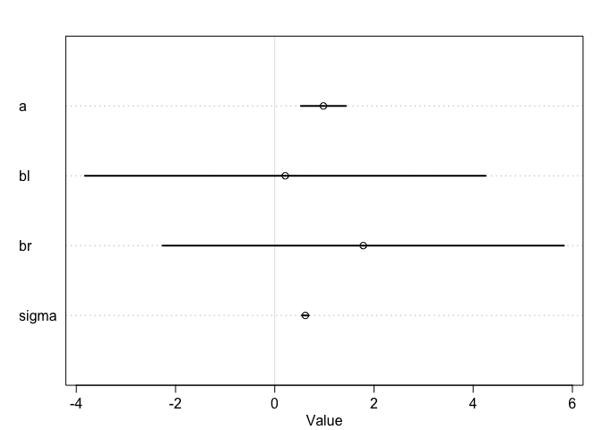
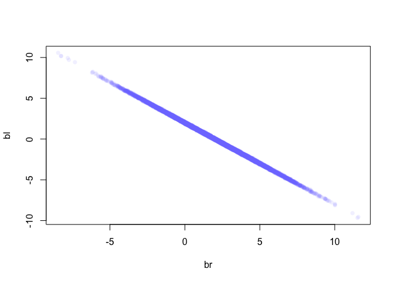
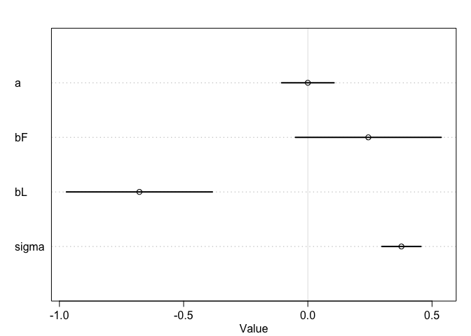
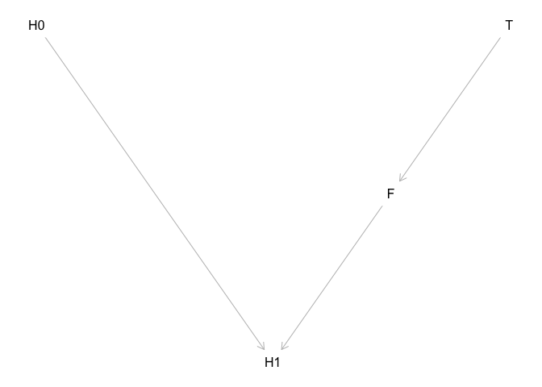

# Book Notes


```r
# Setup
library(rethinking)
library(here)
```


**Overthinking: Simulated Science Distortion**

```r
set.seed(1914)
N <- 200 # Number of grant proposals
p <- 0.1 # Proportion of proposals to select

# Uncorrelated newsworthiness and trustworthiness
nw <- rnorm(N)
tw <- rnorm(N)

# Select top 10% of combined scores
s <- nw + tw
q <- quantile(s, 1-p)
selected <- ifelse(s >= q, TRUE, FALSE)
cor(tw[selected], nw[selected])
```

```
## [1] -0.7680083
```

## 6.1: Multicollinearity

* **Multicollinearity**: a strong correlation between two or more predictor variables

### Example 1: Predicting heigh using both leg lengths

```r
set.seed(909)

N <- 100 # Number of individuals
height <- rnorm(N, 10, 2) # Number of samples to draw, mean of 10, sd of 2
leg_prop <- runif(N, 0.4, 0.5) # Minimum prop is 0.4, max is 0.5
leg_left <- leg_prop * height + rnorm(N, 0, 0.02)
leg_right <- leg_prop * height + rnorm(N, 0, 0.02)

# Combine into dataframe
d <- data.frame(height, leg_left, leg_right)

# Analyze the data
m6.1 <- quap(
  alist(
    height ~ dnorm(mu, sigma),
    mu <- a + bl*leg_left + br*leg_right,
    a ~ dnorm(10, 100),
    bl ~ dnorm(2, 10), 
    br ~ dnorm(2, 10), 
    sigma ~ dexp(1)
  ),
  data = d
)
precis(m6.1)
```

```
##            mean         sd       5.5%     94.5%
## a     0.9812791 0.28395540  0.5274635 1.4350947
## bl    0.2118585 2.52703706 -3.8268348 4.2505518
## br    1.7836774 2.53125061 -2.2617500 5.8291047
## sigma 0.6171026 0.04343427  0.5476862 0.6865189
```

```r
# Plot the coefficients
plot(precis(m6.1))
```

<!-- -->

Why are these coefficients so wonky? Because with multiple regression, we are asking how helpful knowing each predictor is *if we already know the other predictors*. In this case, it isn't very helpful to know the length of one leg when we already know the length of the other leg.

From this plot, we can see that the data from each leg are almost identical:

```r
post <- extract.samples(m6.1)
plot(bl ~ br, post, col=col.alpha(rangi2, 0.1), pch = 16)
```

<!-- -->

Basically, we have evaluated a model using the same predictor with two $\beta$ coefficients:

$$
y_i \sim Normal(\mu_i, \sigma) \\
\mu_i = \alpha + \beta_1 x_i + \beta_2 x_i \\
   \space\space\space\space   = \alpha + (\beta_1 + \beta_2) x_i
$$
This means that the $\beta$ values only influence the outcome variable through their sum--they can't have separate influences.

The model is still fine for prediction, but it can't explain to you what's happening or which leg is more important. This could have dire implications for models where the relationship between two predictor variables *isn't* so obvious.

### Example 2: Milk

```r
data(milk)
d <- milk
d$K <- scale(d$kcal.per.g)
d$F <- scale(d$perc.f)
d$L <- scale(d$perc.lactose)
```

We want to model the total energy content of milk based on %fat and %lactose


```r
# kcal.per.g regressed on perc.fat
m6.3 <- quap(
  alist(
    K ~ dnorm(mu, sigma),
    mu <- a + bF*F, 
    a ~ dnorm(0, 0.2),
    bF ~ dnorm(0, 0.5),
    sigma ~ dexp(1)
  ), 
  data = d
)

# kcal.per.g regressed on perc.lactose
m6.4 <- quap(
  alist(
    K ~ dnorm(mu, sigma),
    mu <- a + bL*L,
    a ~ dnorm(0, 0.2),
    bL ~ dnorm(0, 0.5),
    sigma ~ dexp(1)
  ), 
  data = d
)

precis(m6.3)
```

```
##                mean         sd       5.5%     94.5%
## a     -2.742236e-06 0.07725187 -0.1234662 0.1234607
## bF     8.619013e-01 0.08426070  0.7272364 0.9965662
## sigma  4.510174e-01 0.05870739  0.3571917 0.5448432
```

```r
precis(m6.4)
```

```
##                mean         sd       5.5%      94.5%
## a      2.831124e-07 0.06661631 -0.1064654  0.1064660
## bL    -9.024557e-01 0.07132845 -1.0164523 -0.7884591
## sigma  3.804651e-01 0.04958255  0.3012226  0.4597076
```

Coefficients are almost mirror images of each other. So if we put them in the same model:


```r
m6.5 <- quap(
  alist(
    K ~ dnorm(mu, sigma),
    mu <- a + bF*F + bL*L,
    a ~ dnorm(0, 0.2),
    bF ~ dnorm(0, 0.5),
    bL ~ dnorm(0, 0.5),
    sigma ~ dexp(1)
  ),
  data = d
)
precis(m6.5)
```

```
##                mean         sd        5.5%      94.5%
## a      1.899943e-07 0.06603588 -0.10553790  0.1055383
## bF     2.435008e-01 0.18357894 -0.04989379  0.5368954
## bL    -6.780796e-01 0.18377701 -0.97179072 -0.3843684
## sigma  3.767425e-01 0.04918416  0.29813670  0.4553483
```

```r
plot(precis(m6.5))
```

<!-- -->

The effect is blunted and the credible intervals get wider. Why? Because the two predictor variables are *highly* correlated.

You can use a correlation matrix to find out which pairs of variables are correlated around 0.9 or above, but you need a good conceptual, scientific model to know whether the two variables are providing the same info or if they are correlated for another reason. Don't just drop one of a pair of highly correlated variables and hope for the best.

Multicollinearity is part of a family of problems known as **Non-Identifiability**. Parameters are nonidentifiable when the structure of the data and the model do not allow for a good estimate of the parameter. Bayesian parameters are technically always identified, but often they are only *weakly* identified.

## 6.2: Post-Treatment Bias

* **Post-treatment bias**: including variables that are consequences of other variables

### Example 1: Fungal treatment on plant height

```r
set.seed(71)

N <- 100 # Number of plants

# Simulate initial heights
h0 <- rnorm(N, 10, 2)

# Assign treatments--half have the treatment (1) and half don't (0)
treatment <- rep(0:1, each = N/2)

# Simulate presence of fungus
## For each of N plants, there is an initial 50% chance of having fungus; this number goes down to 10% if the plant is treated with an antifungal
fungus <- rbinom(N, size = 1, prob = 0.5 - treatment*0.4)
# Final height 
## A function of initial height + a random number centered around 5 (for no fungus) and 2(if there is fungus)
h1 <- h0 + rnorm(N, 5 - 3*fungus)

# Put values in clean data frame
d <- data.frame(h0 = h0, h1 = h1, treatment = treatment, fungus = fungus)
precis(d)
```

```
##               mean        sd      5.5%    94.5%    histogram
## h0         9.95978 2.1011623  6.570328 13.07874 ▁▂▂▂▇▃▂▃▁▁▁▁
## h1        14.39920 2.6880870 10.618002 17.93369     ▁▁▃▇▇▇▁▁
## treatment  0.50000 0.5025189  0.000000  1.00000   ▇▁▁▁▁▁▁▁▁▇
## fungus     0.23000 0.4229526  0.000000  1.00000   ▇▁▁▁▁▁▁▁▁▂
```

Now let's model the data using just the height variables. First, we need a prior. One way to do that is to set a prior around the proportion of `h0` to `h1`. Because this proportion cannot be negative, a log-normal distribution could work. Let's try it out:


```r
sim_p <- rlnorm(1e4, 0, 0.25)
precis(data.frame(sim_p))
```

```
##          mean        sd     5.5%    94.5%    histogram
## sim_p 1.03699 0.2629894 0.670683 1.496397 ▁▁▃▇▇▃▁▁▁▁▁▁
```

Consider that if *p* = 1, that would mean that the plant didn't grow. This means that 0.67 means the plant shrunk and 1.5 means that the plant grew. This seems reasonable.


```r
m6.6 <- quap(
  alist(
    h1 ~ dnorm(mu, sigma),
    mu <- h0*p,
    p ~ dlnorm(0, 0.25),
    sigma ~ dexp(1)
  ),
  data = d
)
precis(m6.6)
```

```
##           mean         sd     5.5%    94.5%
## p     1.426626 0.01760992 1.398482 1.454770
## sigma 1.793286 0.12517262 1.593236 1.993336
```

Now to add in treatment and fungus variables as predictors of the proportion of growth, $p$. Thus, there will be two linear equations in this model. $p$ will be a function of fungus & treatment. The mean of the final height distribution will be a function of initial height plus this proportion of growth.


```r
m6.7 <- quap(
  alist(
  h1 ~ dnorm(mu, sigma),
  mu <- h0*p,
  p <- a + bT*treatment + bF*fungus,
  a ~ dlnorm(0, 0.25),
  bT ~ dnorm(0, 0.5),
  bF ~ dnorm(0, 0.5),
  sigma ~ dexp(1)
  ),
  data = d
)
precis(m6.7)
```

```
##               mean         sd        5.5%       94.5%
## a      1.482826979 0.02452189  1.44363627  1.52201769
## bT     0.001060412 0.02987665 -0.04668825  0.04880907
## bF    -0.267912525 0.03654977 -0.32632611 -0.20949894
## sigma  1.408654939 0.09859120  1.25108716  1.56622272
```

The mean of $p$ is about the same as before. But it appears that treatment has no effect on growth, and fungus has a slight negative effect on growth. Why?? Because fungus is a consequence of treatment. We were basically asking the question "Once we know whether or not a plant developed fungus, does knowing whether a plant had soil treatment matter?" And no, it doesn't really. But if we want to know "Does treatment matter?", we should eliminate fungus from our model and try again:


```r
m6.8 <- quap(
  alist(
    h1 ~ dnorm(mu, sigma), 
    mu <- h0 * p,
    p <- a + bT*treatment,
    a ~ dlnorm(0, 0.2),
    bT ~ dnorm(0, 0.5),
    sigma ~ dexp(1)
  ),
  data = d
)
precis(m6.8)
```

```
##             mean         sd       5.5%     94.5%
## a     1.38035767 0.02517554 1.34012229 1.4205931
## bT    0.08499924 0.03429718 0.03018573 0.1398128
## sigma 1.74631655 0.12191552 1.55147200 1.9411611
```

Now, keep in mind that the way the model behaves when fungus growth is included tells us something about the mechanism. The fact that including `fungus` zeros out the effect of `treatment` says that the treatment works by reducing fungus growth. If `fungus` *didn't* zero out `treatment`, then there might be a different mechanism at play (e.g. maybe the treatment has added nutrients that help the plant grow but do not inhibit fungal growth).

#### Using `daggity`


```r
library(dagitty)
plant_dag <- dagitty("dag{
  H0 -> H1
  F -> H1
  T -> F
}")

# Must include coordinates in order to plot
coordinates(plant_dag) <- list(x = c(H0 = 0, T = 2, F = 1.5, H1 = 1),
                               y = c(H0 = 0, T = 0, F = 1,   H1 = 2))
plot(plant_dag)
```

<!-- -->

Testing DAG implications, such as is variables are independent whether or not they are conditioned on some other variable


```r
dseparated(plant_dag, "T", "H1",)
```

```
## [1] FALSE
```

```r
dseparated(plant_dag, "T", "H1", "F")
```

```
## [1] TRUE
```

```r
# All implied conditional independences
impliedConditionalIndependencies(plant_dag)
```

```
## F _||_ H0
## H0 _||_ T
## H1 _||_ T | F
```

So `fungus` and `H0` are always independent, as are `H0` and `treatment`. `H1` and `treatment` are independent only when conditioning on `fungus`.

## 6.3 Collider Bias

* **Collider**: when two arrows in a DAG enter the same third variable--a common "effect" rather than a common "cause"
* **Collider bias**: when you condition on a collider (i.e. include it in your model as a predictor), it creates a statistical relationship among its causes despite no relation existing *before* you stratify on the collider.

### Example 1: Simulated Happiness


```r
# Use rethinking formula to simulate 1000 years of people
d <- sim_happiness(seed = 1977, N_years=1000)
precis(d) # Age uniform, marriage binom, happiness weird
```

```
##                    mean        sd      5.5%     94.5%     histogram
## age        3.300000e+01 18.768883  4.000000 62.000000 ▇▇▇▇▇▇▇▇▇▇▇▇▇
## married    3.007692e-01  0.458769  0.000000  1.000000    ▇▁▁▁▁▁▁▁▁▃
## happiness -1.000070e-16  1.214421 -1.789474  1.789474      ▇▅▇▅▅▇▅▇
```


```r
# Rescale age to include only 18-65 year olds
## First select out 17 year olds
d2 <- d[d$age > 17, ]
## Then standardize to the mean?
d2$A <- (d2$age - 18)/(65 - 18)
```


```r
# Construct marriage status index
d2$mid <- d2$married + 1  # because coded as 0 and 1
```


```r
m6.9 <- quap(
  alist(
    happiness ~ dnorm(mu, sigma),
    mu <- a[mid] + bA*A,
    a[mid] ~ dnorm(0, 1),
    bA ~ dnorm(0, 2),
    sigma ~ dexp(1)
  ),
  data = d2
)

precis(m6.9, depth = 2)
```

```
##             mean         sd       5.5%      94.5%
## a[1]  -0.2350877 0.06348986 -0.3365568 -0.1336186
## a[2]   1.2585517 0.08495989  1.1227694  1.3943340
## bA    -0.7490274 0.11320112 -0.9299447 -0.5681102
## sigma  0.9897080 0.02255800  0.9536559  1.0257600
```

According to this model, age is negatively associated with happiness. However, if you omit marriage status:


```r
m6.10 <- quap(
  alist(
    happiness ~ dnorm(mu, sigma),
    mu <- a + bA*A,
    a ~ dnorm(0, 1),
    bA ~ dnorm(0, 2),
    sigma ~ dexp(1)
  ),
  data = d2
)
precis(m6.10)
```

```
##                mean         sd       5.5%     94.5%
## a      1.649248e-07 0.07675015 -0.1226614 0.1226617
## bA    -2.728620e-07 0.13225976 -0.2113769 0.2113764
## sigma  1.213188e+00 0.02766080  1.1689803 1.2573949
```

...there is no relationship between age and happiness.

### Example 2: The Haunted DAG

<div class="figure" style="text-align: center">

<p class="caption">The Haunted DAGS</p>
</div>

To simulate these data for 200 grandparent-parent-child triads:


```r
N <- 200
b_GP <- 1 # direct effect of G on P
b_GC <- 0 # direct effect of G on C
b_PC <- 1 # direct effect of P on C
b_U <- 2  # direct effect of U on P and C
```


```r
set.seed(1)
U <- 2*rbern(N, 0.5) - 1
G <- rnorm(N)
P <- rnorm(N, b_GP*G + b_U*U)
C <- rnorm(N, b_PC*P + b_GC*G+ b_U*U)
d <- data.frame(C = C, P = P, G = G, U = U)
```

Model the data:

```r
m6.11 <- quap(
  alist(
    C ~ dnorm(mu, sigma),
    mu <- a + b_PC*P + b_GC*G,
    a ~ dnorm(0, 1),
    c(b_PC, b_GC) ~ dnorm(0, 1),
    sigma ~ dexp(1)
  ), data = d
)
precis(m6.11)
```

```
##             mean         sd       5.5%       94.5%
## a     -0.1174752 0.09919574 -0.2760091  0.04105877
## b_PC   1.7868915 0.04455355  1.7156863  1.85809664
## b_GC  -0.8389537 0.10614045 -1.0085867 -0.66932077
## sigma  1.4094891 0.07011139  1.2974375  1.52154063
```

The model is very confident that grandparent education *hurts* their grandchildren. Why? Because P is a collider and because the effect of grandparents on children is through parents. When you condition on P, you create a statistical (but not causal) relationship between Grandparents and an Unmeasured variable (maybe neighborhood). Because neightborhood is unmeasured, the effect flows through to grandparents, and makes it look like grandparents have a negative effect on child education. In reality, bad *neighborhoods* hurt child education.


```r
m6.12 <- quap(
  alist(
    C ~ dnorm(mu, sigma),
    mu <- a + b_PC*P + b_GC*G + b_U*U,
    a ~ dnorm(0, 1),
    c(b_PC, b_GC, b_U) ~ dnorm(0, 1),
    sigma ~ dexp(1)
  ),
  data = d
)
precis(m6.12)
```

```
##              mean         sd       5.5%        94.5%
## a     -0.12197510 0.07192588 -0.2369265 -0.007023655
## b_PC   1.01161103 0.06597258  0.9061741  1.117047948
## b_GC  -0.04081373 0.09728716 -0.1962974  0.114669941
## b_U    1.99648992 0.14770462  1.7604294  2.232550439
## sigma  1.01959911 0.05080176  0.9384081  1.100790130
```

By including 0, we have retrieved the parameter estimates from which we originally simulated the data.

## 6.4 Confronting Confounding

*Four types of DAGS*

1. **Fork**: X <- Z -> Y
  * Classic common cause
  * Block backdoor path through Z by conditioning on Z
    - This works because conditioning means "Once you know Z, then learning about X tells us nothing about Y" unless there is also a direct path from X to Y
2. **Pipe**: X -> Z -> Y
  * Also block backdoor path through Z by conditioning on Z
    - We often do not want to do this
3. **Collider**: X -> Z <- Y
  * Conditioning on Z *opens* the backdoor path--before that, X and Y are independent
4. **Descendent**: X -> Z -> Y, and Z -> K
  * Controlling for a descendant also partially controls for the parent
  
### Using `dagitty` to shut backdoors


```r
dag_6.1 <- dagitty( "dag {
  X -> Y <- C
  X <- U -> B
  U <- A -> C
  U -> B <- C
}")

adjustmentSets(dag_6.1, exposure = "X", outcome = "Y")
```

```
##  { C }
##  { A }
##  { U }
```

### Rethinking: DAGs are not enough
* A DAG is not a substitute for a real, mechanistic model of your system. They can't model dynamical systems, complex behavior, or systems sensitive to initial conditions. But if you lack an understanding of these things, DAGs can help with initial theory building
  
Can use `impliedConditionalIndependencies()` to test what paths would need to be closed for pairs of variables in a DAG to be independent and decide if they make sense. If they don't, may need to add more parameters to DAG
  


