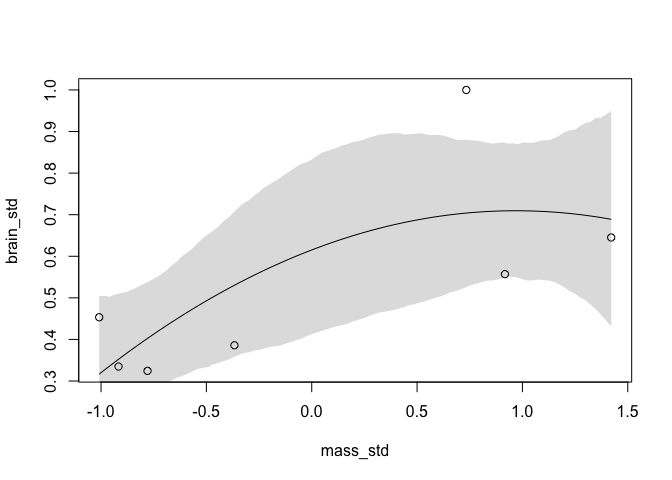
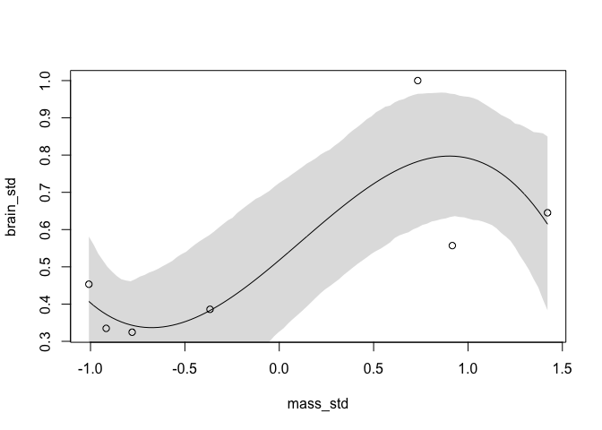

# Lecture Notes

## Lecture 07

* Note: first half covered last of content related to Ch06

### Goals

* Understand *overfitting* and *underfitting*
* Introduct *regularization*
* Cross-validation & information criteria
  - Estimate predictive accuracy
  - Estimate overfitting risk
  - Understand how overfitting relates to complexity
  - Identify influential observations
* See that prediction & causal inference are different objectives

### Notes

* *Stargazing*: using asterisks (i.e. p-values) to select model terms
  - p-values are *not* designed to do this! They have nothing to say about predictive accuracy of the model
* Overfitting & Underfitting: the Scylla & Charybdis of Statistics
  - Will always have to navigate the narrow strait between the two
* The problem with parameters
  - Every time to add a parameter, the model will fit the sample better
  - So, cannot use fit to sample as indicator of model accuracy
  - *Underfitting*: learning too little from the data
    + Fit and predict poorly
  - *Overfitting*: learning too much from the data
    + Fit better and predict worse
    + Multilevel models not as susceptible to overfitting--one reason why they are great
* Variance "explained": $R^2$

     $R^2 = \frac{var(outcome)-var(residuals)}{var(outcome)} = 1 - \frac{var(residuals)}{var(outcome)}$
  - You can get an $R^2 = 1$ if you have as many parameters as data points 
* Model fitting: formal definitions
  - *Underfitting*: insensitive to data
  - *Overfitting*: very sensitive to exact data
  - *Regular fit*: sensitive only to the regular features of the sample, not the features idiosyncratic to the sample
  
## Lecture 08

* Information theory
  - Describes degree of uncertainty when outcome is known
  - Information entropy: uncertainty in a probability distribution is average (minus) log-probability of an event
  
      $H(p) = -Elog(p_i) = -\sum p_i(log(p_i) - log(q_i))$
    + Entropy to accuracy
    
      $D_{KL}(p, q) = \sum_{i} p_i(log(p_i) - log(q_i))$
      * Two probability distributions: *p*, *q*
      * *p* is true, *q* is model
      * Distance from *q* to *p* describes the **Divergence** or how good of a model *q* is
  - Simpler models are more accurate because they have higher entropy--they expect more things to possibly happen and are thus less surprised by more things
* Estimating divergence
  - Because we don't know *p*, we need to estimate
  - Can use the log-score (sum of log probabilities of each observation) to score accuracy of a model: $S(q) = \sum log(q_i)$
  - In practice of Bayesian, there is a *distribution* of log scores, the **log-pointwise-predictive density**
  
    $lppd(\gamma, \Theta) = \sum_i log(\frac{1}{S}) \sum_s p(y_i|\theta_s)$

* Regularizing
  - Use informative, conservative priors to reduce overfitting
    + Model will learn less from sample but will perform better out of sample
    + This is why weakly-informative priors perform better than flat priors--model will perform better out of sample
  - Why don't scientists do this more?
    + Not taught
    + Makes significant results harder
    + Scientists not judged on accuracy
* How to estimate out-of-sample deviance?
  - In theory: cross validation
    + Leave out some observations
    + Fit model on remaining observations
    + Score model fit based on how well it fits the left-out data
    + Average over many permutations of left-out sets to get an estimate of out-of-sample accuracy
    + Most common way is to leave one out at a time--but for large samples, this takes forEVER
      * Can use Pareto-smoothed importance sampling (PSIS): `LOO` function in `rethinking`, also the `loo` package
  - Also in theory: Information criteria
    + Approach originally by Akaike information criterion, but makes a lot of restrictive assumptions & so is no longer useful
    + WAIC (Widely Applicable Information Criterion) does not assume Gaussian posterior: $WAIC(y,\Theta)=-2(lppd - \Sigma_i var_{\theta}log p(y_i|\Theta))$
  - Both perform similarly & very well
    + When they disagree, it means there is some high-leverage point that they are handling differently--indicates you shouldn't trust either method and dig into your data
* How to use CV & WAIC
  - Avoid "model selection" (unless you *only* care about prediction)
  - Practice model comparison
    + Multiple models for causal inference
    + Multiple models for explanations
  - Use the `compare()` function in `rethinking` to compare `quap()` models
    + Use cautiously--the model which makes the best predictions is not always the most explanatory model

# Book Notes

## 7.1: The Problem with Parameters
* This chapter is about trade-offs between simplicity & accuracy
  - hence *Ulysses' Compass*, sailing him precariously between Scylla (overfitting) & Charybdis (underfitting)
* The Problem with R^2
  - Formula: $R^2 = \frac{var(outcome) - var(residuals)}{var(outcome)} = 1 - \frac{var(residuals)}{var(outcome)}$
  - $var(outcome)$ is just the variance of the outcome that the model can reproduce--everything else is "residual"
  - As you add parameters, $R^2$ increases no matter what
  - $R^2$ gets closer to 1 as the variance of the residuals shrinks, but residual variance will always shrink with more parameters because it becomes easier and easier to map each data point

### Example 1: Brain Volume & Body Mass

* Setup:


```r
library(rethinking)
```


```r
sppnames <- c("afarensis", "africanus", "habilis", "boisei", "rudolfensis", "ergaster", "sapiens")
brainvolcc <- c(438, 452, 612, 521, 752, 871, 1350)
masskg <- c(37.0, 35.5, 34.5, 41.5, 55.5, 61.0, 53.5)
d <- data.frame(species = sppnames, brain = brainvolcc, mass = masskg)
```

* Next, rescale the predictor and outcome variables
  - This improves ability to get model to fit and makes it easier to specify priors
  - However, do so responsibly--some variables (e.g. brain volume) won't make sense with a 0 reference point

```r
# Convert mass to a z-score
d$mass_std <- (d$mass - mean(d$mass))/sd(d$mass)

# Rescale brain volume in reference to the largest brain
d$brain_std <- d$brain / max(d$brain)
```

* Set the priors

```r
m7.1 <- quap(
  alist(
    brain_std ~ dnorm(mu, exp(log_sigma)),
    mu <- a + b*mass_std,
    a ~ dnorm(0.5, 1),
    b ~ dnorm(0, 10), 
    log_sigma ~ dnorm(0, 1)
  ), data = d
)
```

* Computing $R^2$ to kill it:


```r
set.seed(12)
s <- sim(m7.1)
r <- apply(s, 2, mean) - d$brain_std
resid_var <- var2(r)
outcome_var <- var2(d$brain_std)
1 - resid_var / outcome_var
```

```
## [1] 0.4774589
```

Write a function to do this $R^2$ calculation, following the principle that if you're going to do things many times in the same way, you should write a function.


```r
R2_is_bad <- function(quap_fit){
  s <- sim(quap_fit, refresh = 0)
  r <- apply(s, 2, mean) - d$brain_std
  1 - var2(r)/var2(d$brain_std)
}
```

Now to make new models, each with a higher polynomial degree than the last.


```r
m7.2 <- quap(
  alist(
    brain_std ~ dnorm(mu, exp(log_sigma)),
    mu <- a + b[1]*mass_std + b[2]*mass_std^2,
    a ~ dnorm(0.5, 1),
    b ~ dnorm(0, 10),
    log_sigma ~ dnorm(0, 1)
  ), data = d, start = list(b = rep(0, 2)) # <- tells quap() how long the b vector is
)
```


```r
m7.3 <- quap(
  alist(
    brain_std ~ dnorm(mu, exp(log_sigma)),
    mu <- a + b[1]*mass_std + b[2]*mass_std^2 + 
              b[3]*mass_std^3,
    a ~ dnorm(0.5, 1),
    b ~ dnorm(0, 10),
    log_sigma ~ dnorm(0, 1)
  ), data = d, start = list(b = rep(0, 3))
)

m7.4 <- quap(
  alist(
    brain_std ~ dnorm(mu, exp(log_sigma)),
    mu <- a + b[1]*mass_std + b[2]*mass_std^2 +
              b[3]*mass_std^3 + b[4]*mass_std^4,
    a ~ dnorm(0.5, 1),
    b ~ dnorm(0, 10),
    log_sigma ~ dnorm(0, 1)
  ), data = d, start = list(b = rep(0, 4))
)

m7.5 <- quap(
  alist(
    brain_std ~ dnorm(mu, exp(log_sigma)),
    mu <- a + b[1]*mass_std + b[2]*mass_std^2 +
              b[3]*mass_std^3 + b[4]*mass_std^4 +
              b[5]*mass_std^5,
    a ~ dnorm(0.5, 1),
    b ~ dnorm(0, 10),
    log_sigma ~ dnorm(0, 1)
  ), data = d, start = list(b = rep(0, 5))
)
```

Model m7.6 has to have it's standard deviation fixed to a constant value of 0.001 (see below for reason)


```r
m7.6 <- quap(
  alist(
    brain_std ~ dnorm(mu, 0.001),
    mu <- a + b[1]*mass_std   + b[2]*mass_std^2 +
              b[3]*mass_std^3 + b[4]*mass_std^4 +
              b[5]*mass_std^5 + b[6]*mass_std^6,
    a ~ dnorm(0.5, 1),
    b ~ dnorm(0, 10)
  ), data = d, start = list(b = rep(0, 6))
)
```

Now plot each model.

```r
# Plot M7.1
post <- extract.samples(m7.1)
mass_seq <- seq(from = min(d$mass_std), to = max(d$mass_std), length.out = 100)
# Make a function to do this for the others
plot_R2 <- function(model) {
  post <- extract.samples(model)
  l <- link(model, data = list(mass_std = mass_seq))
  mu <- apply(l, 2, mean)
  ci <- apply(l, 2, PI)
  plot(brain_std ~ mass_std, data = d)
  lines(mass_seq, mu)
  shade(ci, mass_seq)
}
plot_R2(m7.1)
```

<!-- -->

```r
# Plot M7.2
post <- extract.samples(m7.2)
plot_R2(m7.2)
```

<!-- -->

```r
# Plot m7.3
post <- extract.samples(m7.3)
plot_R2(m7.3)
```

<!-- -->

```r
# Plot m7.6 (yes I skipped a few)
plot_R2(m7.6)
```

<!-- -->

Because the 6th-degree polynomial passes exactly through each point, it has a perfect $R^2 = 1$. This is also why $\sigma$ had to be fixed to 0.001--if it were estimated, it would shrink to 0 because there would *be* no residual variance.

Consider model fitting as a form of data compression. You want to keep enough that you can recreate the important bits but do not waste storage space on the noise.

## 7.2 Entropy & Accuracy

* **Information**: The reduction in uncertainty derived from learning an outcome
* What makes a good measure of uncertainty?
  - Is continuous
  - Increases as the number of possible events increases
  - Is additive
* Information Entropy meets all of these criteria:
  - $H(p) = -Elog(p_i) = -\sum p_ilog(p_i)$
    + $n$ is the different possible events
    + $i$ is each event
    + $p_i$ is the probability of each event
  - The uncertainty in a probability distribution is the average log-probability of an event

* Example: if the true probabilities of rain and shine are $p_r = 0.3$ and $p_s = 0.7$, then:


```r
p <- c(0.3, 0.7)
-sum(p * log(p))
```

```
## [1] 0.6108643
```

  - BUT if we lived in Abu Dhabi, the probabilities of rain and shine might be $p_r = 0.01$ and $p_s = 0.99$:


```r
p <- c(0.01, 0.99)
-sum(p * log(p))
```

```
## [1] 0.05600153
```
  
* **Divergence*: the aditional uncertainty induced by using probabilities from one distribution to describe another distribution
  - also know as K-L (Kulback-Leibler) divergence
  - Tells us how much uncertainty we introduce when we guess incorrectly about the true distribution of events
    + $D_{KL}(p, q) = -\sum_i p_i(log(p_i) - log(q_i)) = \sum_i p_ilog(\frac{p_i}{q_i})$
  - It's the average distance in the log probability between the target ($p$) and the model ($q$)
  - Note that $H(p, q) \neq H(q, p)$, which means that we can minimize K-L divergence if we use a high-entropy model
* What's the point of all of this?
  - We needed a way to measure the distance of a model from our target: K-L divergence
  - We needed a way to estimate the divergence with real models where we don't actually *know* the target
* What do do when we don't know $p$:
  - When comparing the divergence of two models, $Elog(p_i)$ subtracts out, just leaving the log-probabilities of the models
    + $S(q) = \sum_i log(q_i)$ is the total score for model $q$
    + This formula only makes sense when compared to another model--absolute value of entropy score is, on its own, uninterpretable
  - In a Bayesian framework, you sum the log-probability over the entire posterior (rather than just the main point estimate)
    + In other words, You need to log the average probability for each observation across the posterior
  - In `rethinking` package, use the function `lppd`: **log-pointwise-predictive-density**
  

```r
set.seed(1)
lppd(m7.1, n = 1e4)
```

```
## [1]  0.6098669  0.6483445  0.5496122  0.6234941  0.4648184  0.4347655 -0.8444747
```
  - Output: the log-probability score for each observation; if you sum across them, you get the total log-probability score for the model + data
    + Larger numbers are better
    + Can also calculate **Deviance**, which is the lppd score multiplied by -2, so smaller values are better (this is there for historical reasons, not mathematical ones)
  - Overthinking: Caluculating lppd in a Bayesian framework

```r
set.seed(1)
logprob <- sim(m7.1, ll = TRUE, n = 1e4)
n <- ncol(logprob)
ns <- nrow(logprob)
f <- function(i) log_sum_exp(logprob[,i]) - log(ns)
(llpd <- sapply(1:n, f))
```

```
## [1]  0.6098669  0.6483445  0.5496122  0.6234941  0.4648184  0.4347655 -0.8444747
```

```r
sapply(list(m7.1, m7.2, m7.3, m7.4, m7.5, m7.6), function(m) sum(lppd(m)))
```

```
## [1]  2.424825  2.646561  3.694617  5.316186 14.112180 39.509528
```

More complex models have higher lppd scores, but that will always be true. So we can't score models based on how they perform on training data, but rather how they perform on test data. Training data will always get better as you add parameters, but out-of-sample test data will *not*. The true model should minimize out-of-sample deviance, but it will not necessarily be the one that minimizes deviance *the most*--prediction and accuracy are two different goals.

### Overthinking: Simulated training and testing--DO NOT EVALUATE

```r
N <- 20
kseq <- 1:5
dev <- sapply(kseq, function(k) {
  print(k);
  # For sim_train_test, N is number of cases simulated and k is number of parameters to fit
  r <- mcreplicate(1e4, sim_train_test(N = N, k = k), mc.cores = 4);
  c(mean(r[1,]), mean(r[2,]), sd(r[1,]), sd(r[2,]))
})
```


