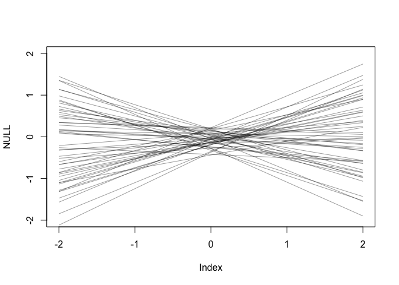
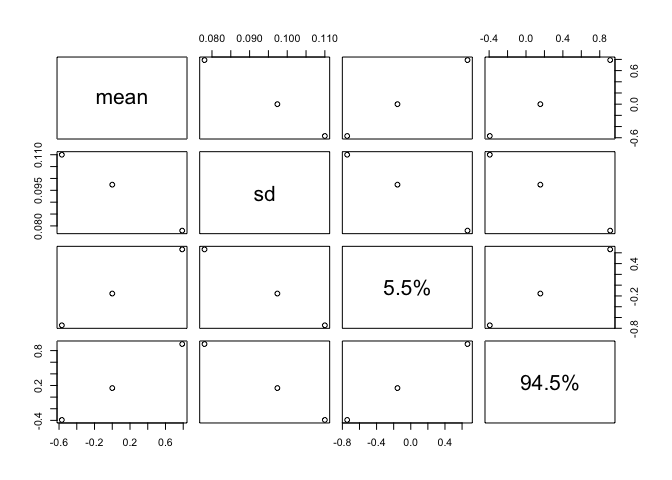
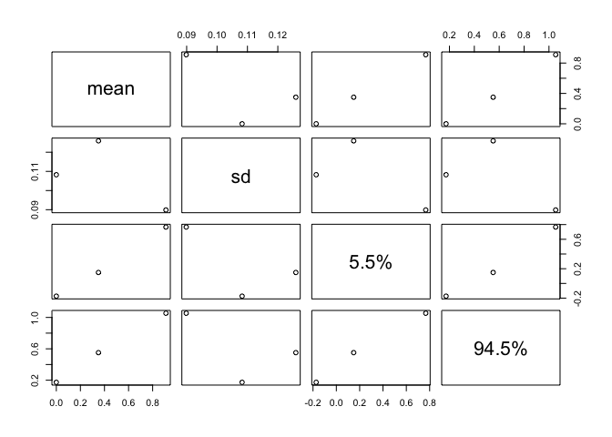
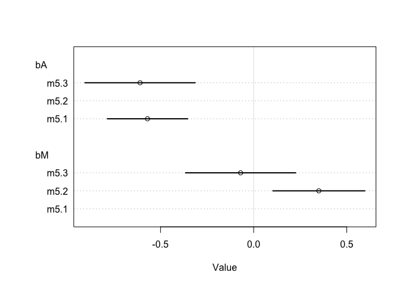

# CHAPTER 5: The Many Variables & Spurious Waffles


```r
# Setup
install.packages(c("devtools", "mvtnorm", "loo", "coda"), dependencies = TRUE)
library(devtools)

# Most recent package as of 10.30.19
install_github("rmcelreath/rethinking",ref="Experimental")
```


```r
# Load in the Waffle House data
data("WaffleDivorce")

d = WaffleDivorce

# Standardize variables
d$A = scale(d$MedianAgeMarriage)
d$D = scale(d$Divorce)
```


## Model 1

```r
# P.130 example
# Note: need to call variables in the data by their names
m5.1 = quap(
  alist(
    D ~ dnorm(mu, sigma),
    mu <- a + bA*A,
    a ~ dnorm(0, 0.2),
    bA ~ dnorm(0, 0.5),
    sigma ~ dexp(1)
  ),
  data = d
)
precis(m5.1)
```

```
##                mean         sd       5.5%      94.5%
## a      8.303150e-07 0.09737870 -0.1556291  0.1556308
## bA    -5.684036e-01 0.10999971 -0.7442043 -0.3926028
## sigma  7.883250e-01 0.07801117  0.6636481  0.9130019
```

### Checks

```r
# Prior predictive checks
set.seed(10)
prior = extract.prior(m5.1)
mu = link(m5.1, post=prior, data = list(A=c(-2, 2)))
plot(NULL, xlim=c(-2, 2), ylim = c(-2, 2))
for (i in 1:50) {
  lines(c(-2, 2), mu[i,], col=col.alpha("black", 0.4))
}
```

<!-- -->

```r
# Posterior computation
A_seq <- seq(from = -3, to = 3.2, length.out = 30)
mu <- link(m5.1, data = list(A=A_seq))
muMean <- apply(mu, 2, mean)
muPI <- apply(mu, 2, PI)
precis(m5.1)
```

```
##                mean         sd       5.5%      94.5%
## a      8.303150e-07 0.09737870 -0.1556291  0.1556308
## bA    -5.684036e-01 0.10999971 -0.7442043 -0.3926028
## sigma  7.883250e-01 0.07801117  0.6636481  0.9130019
```

```r
plot(m5.1)
```

<!-- -->

## Model 2: Modelling the relationship between marriage rate and divorce

```r
d$M = scale(d$Marriage)
m5.2 = quap(
  alist(
    D ~ dnorm(mu, sigma),
    mu <- a + bM*M,
    a ~ dnorm(0, 0.2),
    bM ~ dnorm(0, 0.5),
    sigma ~ dexp(1)
  ),
  data = d
)
precis(m5.2)
```

```
##               mean         sd       5.5%     94.5%
## a     2.918047e-07 0.10824642 -0.1729984 0.1729990
## bM    3.500540e-01 0.12592744  0.1487977 0.5513104
## sigma 9.102653e-01 0.08986239  0.7666479 1.0538828
```

```r
plot(m5.2)
```

<!-- -->

## Model 3: Modelling the relationship bewteen marriage rate, age of marriage, & divorce

```r
m5.3 <- quap(
  alist(
    D ~ dnorm(mu, sigma),
    mu <- a + bM*M + bA*A,
    a ~ dnorm(0, 0.2),
    bM ~ dnorm(0, 0.5),
    bA ~ dnorm(0, 0.5),
    sigma ~ dexp(1)
  ), 
  data = d
)
precis(m5.3)
```

```
##                mean         sd       5.5%      94.5%
## a     -2.828642e-05 0.09707123 -0.1551669  0.1551103
## bM    -6.553086e-02 0.15076312 -0.3064794  0.1754177
## bA    -6.136370e-01 0.15097351 -0.8549218 -0.3723521
## sigma  7.850672e-01 0.07783076  0.6606786  0.9094558
```

```r
plot(coeftab(m5.1, m5.2, m5.3), par = c("bA", "bM"))
```

<!-- -->

## Side Note: Simulating Divorce Data

```r
# Simulation the divorce data
N <- 50
# If you just use rnorm with a sample size, draws a sample from the standard normal curve
## This is useful bc values are automatically standardized
age <- rnorm(N)
# Simulated a vector of z-scores, where each zscore was dependent on the age of the person in the age vector
mar <- rnorm(N, age)
```

## Models 4 & 5


```r
# Predictor Residual Plots
m5.4 <- quap(
  alist(
    M ~ dnorm(mu, sigma),
    mu <- a + bA,
    a ~ dnorm(0, 0.2),
    bA ~ dnorm(0, 0.5),
    sigma ~ dexp(1)
  ),
  data = d
)
precis(m5.4)
```

```
##                mean         sd       5.5%     94.5%
## a     -2.391497e-05 0.18661655 -0.2982732 0.2982254
## bA     2.866162e-05 0.21881581 -0.3496813 0.3497386
## sigma  9.803773e-01 0.09662554  0.8259510 1.1348036
```

```r
## Calculate the residual
mu <- link(m5.4)
muMean <- apply(mu, 2, mean)
muResid <- d$M - muMean
```


# Counterfactual Plots
## Prepare new counterfactual data
M_seq <- seq(-2, 3, length.out = 30)
pred_data <- data.frame(M = M_seq, A = 0)

# compute counterfactual mean divorce (mu)
mu <- link(m5.3, data = pred_data)
muMean <- apply(mu, 2, mean)
muPI <- apply(mu, 2, PI)

# simulate counterfactual divorce outcomes
D_sim <- sim(m5.3, data = pred_data, n=1e4)
D_PI <- apply(D_sim, 2, PI)

# display predictions; hide raw data with type "n"
plot(D ~ M, data = d, type = "n")
mtext("Median age marriage(std) = 0")
lines(M_seq, muMean)
shade(muPI, M_seq)
shade (D_PI, M_seq)

# ------
# Section 5.2
# ------

library(rethinking)
data("milk")
d <- milk
str(d)

# Standardize the variables
d$kCal <- scale(d$kcal.per.g)
d$neoCor <- scale(d$neocortex.perc)
d$M <- scale(log(d$mass))

# Run bivariate regression with vague priors
## This model will throw an error because of missing values in the neocortex data
m5.5_draft <- quap(
  alist(
    kCal ~ dnorm(mu, sigma),
    mu <- a + bN*neoCor,
    a ~ dnorm(0, 1), 
    bN ~ dnorm(0, 1),
    sigma ~ dexp(1)
  ), data = d
)

# Make a new data frame without missing values
## Looks for rows with complete cases for 3 variables
dcc <- d[complete.cases(d$kCal, d$neoCor, d$M), ]

# Try the model again
m5.5_draft <- quap(
  alist(
    kCal ~ dnorm(mu, sigma),
    mu <- a + bN*neoCor,
    a ~ dnorm(0, 1), 
    bN ~ dnorm(0, 1),
    sigma ~ dexp(1)
  ), data = dcc
)

# Prior predictive checks
prior <- extract.prior(m5.5_draft)
xseq <- c(-2, 2)
mu <- link(m5.5_draft, post = prior, data = list(neoCor=xseq))
plot(NULL, xlim = xseq, ylim = xseq)
for(i in 1:50){
  lines(xseq, mu[i, ], col=col.alpha("black", 0.3))
}
# Produces crazy impossible outcomes


# Tweak the priors to be more reasonable
m5.5 <- quap(
  alist(
    kCal ~ dnorm(mu, sigma),
    mu <- a + bN*neoCor,
    a ~ dnorm(0, 0.2), 
    bN ~ dnorm(0, 0.5),
    sigma ~ dexp(1)
  ), data = dcc
)

# Plot again
prior <- extract.prior(m5.5)
xseq <- c(-2, 2)
mu <- link(m5.5, post = prior, data = list(neoCor=xseq))
plot(NULL, xlim = xseq, ylim = xseq)
for(i in 1:50) {
  lines(xseq, mu[i,], col=col.alpha("black", 0.3))
}

# Not a strong bivariate relationship....
precis(m5.5)

# Plot the posterior
xseq <- seq(from=min(dcc$neoCor) - 0.15, to=max(dcc$neoCor) + 0.15, length.out = 30)
mu <- link(m5.5, data=list(neoCor=xseq))
muMean <- apply(mu, 2, mean)
muPI <- apply(mu, 2, PI)
plot(kCal ~ neoCor, data = dcc)
lines(xseq, muMean, lwd=2)
shade(muPI, xseq)
# Not very strong relationship indeed...

# New model! with mother body mass
m5.6 <- quap(
  alist(
    kCal ~ dnorm(mu, sigma),
    mu <- a + bM*M,
    a ~ dnorm(0, 0.2),
    bM ~ dnorm(0, 0.5),
    sigma ~ dexp(1)
  ), data = dcc
)
precis(m5.6)

# Plot the posterior
xseq <- seq(from=min(dcc$M) - 0.15, to=max(dcc$M) + 0.15, length.out = 30)
mu <- link(m5.6, data = list(M=xseq))
muMean <- apply(mu, 2, mean)
muPI <- apply(mu, 2, PI)
plot(kCal ~ M, data = dcc)
lines(xseq, muMean, lwd = 2)
shade(muPI, xseq)

# Multivariate model with both predictors
m5.7 <- quap(
  alist(
    kCal ~ dnorm(mu, sigma),
    mu ~ a + bN*neoCor + bM*M,
    a ~ dnorm(0, 0.2),
    bN ~ dnorm(0, 0.5),
    bM ~ dnorm(0, 0.5),
    sigma ~ dexp(1)
  ), data = dcc
)
precis(m5.7)

# Plot the coefficients in each model
plot(coeftab(m5.5, m5.6, m5.7), pars=c("bM", "bN"))

pairs(~kCal + M + neoCor, dcc)


# ------
# Section 5.3: Categorical Variables
# ------

# Load in Kalahari height data
data("Howell1")
d <- Howell1
str(d)

# Recode male variable as 1s and 2s to make it an index variable
d$sex <- ifelse(d$male==1, 2, 1)
str(d$sex)

m5.8 <- quap(
  alist(
    height ~ dnorm(mu, sigma),
    mu <- a[sex],
    a[sex] ~ dnorm(178, 20),
    sigma ~ dunif(0, 50)
  ), data = d
)
precis(m5.8, depth = 2)

# Calculate difference between males and females on height
post <- extract.samples(m5.8)
post$diff_fm <- post$a[, 1] - post$a[ , 2]
precis(post, depth = 2)
