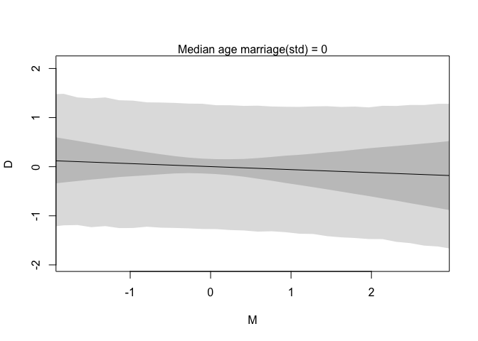
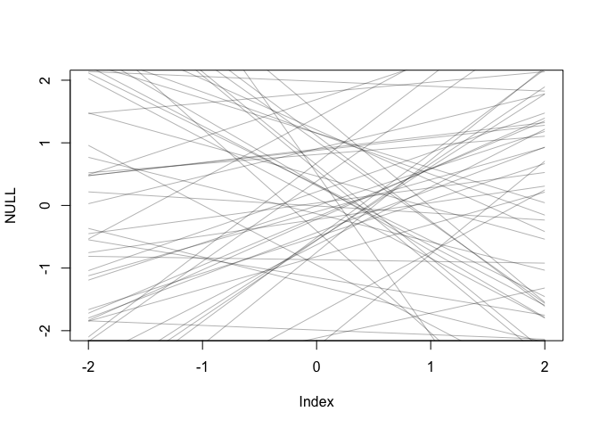
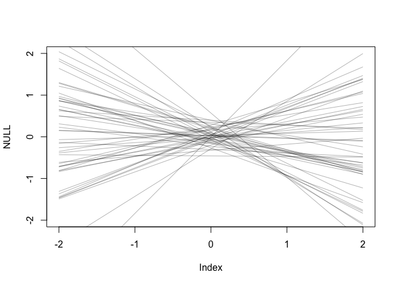
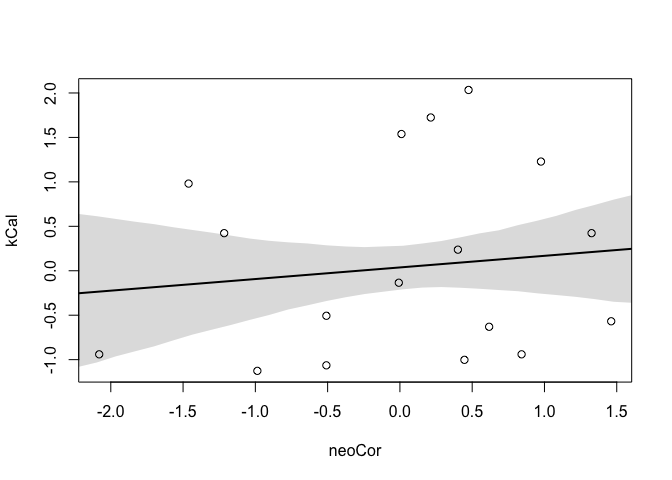
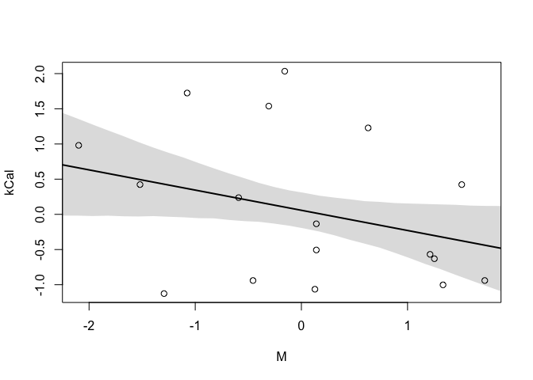
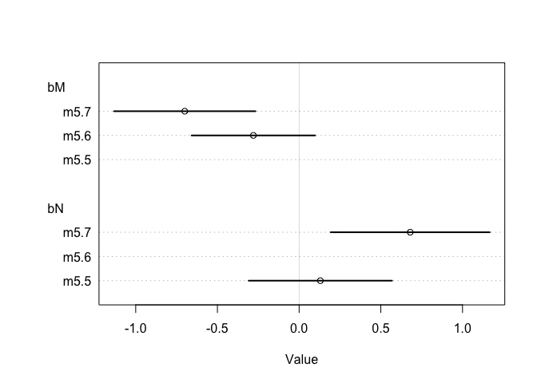
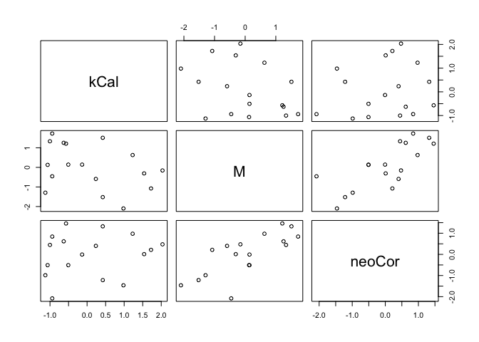
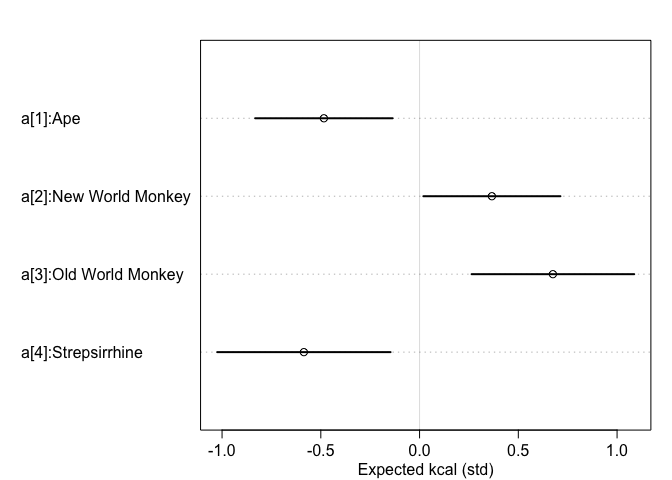
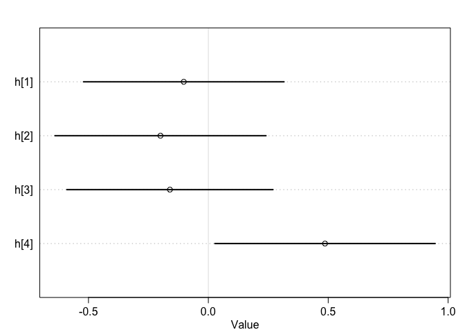

# CHAPTER 5: The Many Variables & Spurious Waffles


```r
# Setup
install.packages(c("devtools", "mvtnorm", "loo", "coda"), dependencies = TRUE)
library(devtools)

# Most recent package as of 10.30.19
install_github("rmcelreath/rethinking",ref="Experimental")
```


```r
# If above code-chunk has run:
library(rethinking)
```

## Section 5.1: Spurious Association


```r
# Load in the Waffle House data
data("WaffleDivorce")

d = WaffleDivorce

# Standardize variables
d$A = scale(d$MedianAgeMarriage)
d$D = scale(d$Divorce)
```


### Model 1

```r
# P.130 example
# Note: need to call variables in the data by their names
m5.1 = quap(
  alist(
    D ~ dnorm(mu, sigma),
    mu <- a + bA*A,
    a ~ dnorm(0, 0.2),
    bA ~ dnorm(0, 0.5),
    sigma ~ dexp(1)
  ),
  data = d
)
precis(m5.1)
```

```
##                mean         sd       5.5%      94.5%
## a     -3.355203e-08 0.09737873 -0.1556300  0.1556300
## bA    -5.684034e-01 0.10999975 -0.7442042 -0.3926025
## sigma  7.883253e-01 0.07801123  0.6636482  0.9130023
```

#### Checks

```r
# Prior predictive checks
set.seed(10)
prior = extract.prior(m5.1)
mu = link(m5.1, post=prior, data = list(A=c(-2, 2)))
plot(NULL, xlim=c(-2, 2), ylim = c(-2, 2))
for (i in 1:50) {
  lines(c(-2, 2), mu[i,], col=col.alpha("black", 0.4))
}
```

<!-- -->

```r
# Posterior computation
A_seq <- seq(from = -3, to = 3.2, length.out = 30)
mu <- link(m5.1, data = list(A=A_seq))
muMean <- apply(mu, 2, mean)
muPI <- apply(mu, 2, PI)
precis(m5.1)
```

```
##                mean         sd       5.5%      94.5%
## a     -3.355203e-08 0.09737873 -0.1556300  0.1556300
## bA    -5.684034e-01 0.10999975 -0.7442042 -0.3926025
## sigma  7.883253e-01 0.07801123  0.6636482  0.9130023
```

```r
plot(m5.1)
```

<!-- -->

### Model 2: Modelling the relationship between marriage rate and divorce

```r
d$M = scale(d$Marriage)
m5.2 = quap(
  alist(
    D ~ dnorm(mu, sigma),
    mu <- a + bM*M,
    a ~ dnorm(0, 0.2),
    bM ~ dnorm(0, 0.5),
    sigma ~ dexp(1)
  ),
  data = d
)
precis(m5.2)
```

```
##               mean         sd       5.5%     94.5%
## a     2.918047e-07 0.10824642 -0.1729984 0.1729990
## bM    3.500540e-01 0.12592744  0.1487977 0.5513104
## sigma 9.102653e-01 0.08986239  0.7666479 1.0538828
```

```r
plot(m5.2)
```

<!-- -->

### Model 3: Modelling the relationship bewteen marriage rate, age of marriage, & divorce

```r
m5.3 <- quap(
  alist(
    D ~ dnorm(mu, sigma),
    mu <- a + bM*M + bA*A,
    a ~ dnorm(0, 0.2),
    bM ~ dnorm(0, 0.5),
    bA ~ dnorm(0, 0.5),
    sigma ~ dexp(1)
  ), 
  data = d
)
precis(m5.3)
```

```
##                mean         sd       5.5%      94.5%
## a     -2.828642e-05 0.09707123 -0.1551669  0.1551103
## bM    -6.553086e-02 0.15076312 -0.3064794  0.1754177
## bA    -6.136370e-01 0.15097351 -0.8549218 -0.3723521
## sigma  7.850672e-01 0.07783076  0.6606786  0.9094558
```

```r
plot(coeftab(m5.1, m5.2, m5.3), par = c("bA", "bM"))
```

<!-- -->

#### Side Note: Simulating Divorce Data

```r
# Simulation the divorce data
N <- 50
# If you just use rnorm with a sample size, draws a sample from the standard normal curve
## This is useful bc values are automatically standardized
age <- rnorm(N)
# Simulated a vector of z-scores, where each zscore was dependent on the age of the person in the age vector
mar <- rnorm(N, age)
```

### Model 5.4


```r
# Predictor Residual Plots
m5.4 <- quap(
  alist(
    M ~ dnorm(mu, sigma),
    mu <- a + bA,
    a ~ dnorm(0, 0.2),
    bA ~ dnorm(0, 0.5),
    sigma ~ dexp(1)
  ),
  data = d
)
precis(m5.4)
```

```
##                mean         sd       5.5%     94.5%
## a     -2.391497e-05 0.18661655 -0.2982732 0.2982254
## bA     2.866162e-05 0.21881581 -0.3496813 0.3497386
## sigma  9.803773e-01 0.09662554  0.8259510 1.1348036
```

```r
## Calculate the residual
mu <- link(m5.4)
muMean <- apply(mu, 2, mean)
muResid <- d$M - muMean
```

#### Counterfactual Plots


```r
## Prepare new counterfactual data
M_seq <- seq(-2, 3, length.out = 30)
pred_data <- data.frame(M = M_seq, A = 0)

# compute counterfactual mean divorce (mu)
mu <- link(m5.3, data = pred_data)
muMean <- apply(mu, 2, mean)
muPI <- apply(mu, 2, PI)

# simulate counterfactual divorce outcomes
D_sim <- sim(m5.3, data = pred_data, n=1e4)
D_PI <- apply(D_sim, 2, PI)

# display predictions; hide raw data with type "n"
plot(D ~ M, data = d, type = "n")
mtext("Median age marriage(std) = 0")
lines(M_seq, muMean)
shade(muPI, M_seq)
shade (D_PI, M_seq)
```

<!-- -->

## Section 5.2: Masked Relationship


```r
# library(rethinking)
data("milk")
d <- milk
str(d)
```

```
## 'data.frame':	29 obs. of  8 variables:
##  $ clade         : Factor w/ 4 levels "Ape","New World Monkey",..: 4 4 4 4 4 2 2 2 2 2 ...
##  $ species       : Factor w/ 29 levels "A palliata","Alouatta seniculus",..: 11 8 9 10 16 2 1 6 28 27 ...
##  $ kcal.per.g    : num  0.49 0.51 0.46 0.48 0.6 0.47 0.56 0.89 0.91 0.92 ...
##  $ perc.fat      : num  16.6 19.3 14.1 14.9 27.3 ...
##  $ perc.protein  : num  15.4 16.9 16.9 13.2 19.5 ...
##  $ perc.lactose  : num  68 63.8 69 71.9 53.2 ...
##  $ mass          : num  1.95 2.09 2.51 1.62 2.19 5.25 5.37 2.51 0.71 0.68 ...
##  $ neocortex.perc: num  55.2 NA NA NA NA ...
```

### Model 5.5


```r
# Standardize the variables
d$kCal <- scale(d$kcal.per.g)
d$neoCor <- scale(d$neocortex.perc)
d$M <- scale(log(d$mass))
```


```r
# Run bivariate regression with vague priors
## This model will throw an error because of missing values in the neocortex data
m5.5_draft <- quap(
  alist(
    kCal ~ dnorm(mu, sigma),
    mu <- a + bN*neoCor,
    a ~ dnorm(0, 1), 
    bN ~ dnorm(0, 1),
    sigma ~ dexp(1)
  ), data = d
)
```


```r
# Make a new data frame without missing values
## Looks for rows with complete cases for 3 variables
dcc <- d[complete.cases(d$kCal, d$neoCor, d$M), ]

# Try the model again
m5.5_draft <- quap(
  alist(
    kCal ~ dnorm(mu, sigma),
    mu <- a + bN*neoCor,
    a ~ dnorm(0, 1), 
    bN ~ dnorm(0, 1),
    sigma ~ dexp(1)
  ), data = dcc
)
```

Check the priors--are they reasonable?


```r
# Prior predictive checks
prior <- extract.prior(m5.5_draft)
xseq <- c(-2, 2)
mu <- link(m5.5_draft, post = prior, data = list(neoCor=xseq))
plot(NULL, xlim = xseq, ylim = xseq)
for(i in 1:50){
  lines(xseq, mu[i, ], col=col.alpha("black", 0.3))
}
```

<!-- -->

Nope! Prior predictive checks indicate that they produce crazy impossible outcomes. We need to tweak the priors to be more reasonable and realistic


```r
# Tweak the priors to be more reasonable
m5.5 <- quap(
  alist(
    kCal ~ dnorm(mu, sigma),
    mu <- a + bN*neoCor,
    a ~ dnorm(0, 0.2), 
    bN ~ dnorm(0, 0.5),
    sigma ~ dexp(1)
  ), data = dcc
)

# Plot again
prior <- extract.prior(m5.5)
xseq <- c(-2, 2)
mu <- link(m5.5, post = prior, data = list(neoCor=xseq))
plot(NULL, xlim = xseq, ylim = xseq)
for(i in 1:50) {
  lines(xseq, mu[i,], col=col.alpha("black", 0.3))
}
```

<!-- -->

```r
# Not a strong bivariate relationship....
precis(m5.5)
```

```
##             mean        sd       5.5%     94.5%
## a     0.03994794 0.1544925 -0.2069608 0.2868567
## bN    0.13323666 0.2237518 -0.2243620 0.4908353
## sigma 0.99984820 0.1647194  0.7365948 1.2631016
```

```r
# Plot the posterior
xseq <- seq(from=min(dcc$neoCor) - 0.15, to=max(dcc$neoCor) + 0.15, length.out = 30)
mu <- link(m5.5, data=list(neoCor=xseq))
muMean <- apply(mu, 2, mean)
muPI <- apply(mu, 2, PI)
plot(kCal ~ neoCor, data = dcc)
lines(xseq, muMean, lwd=2)
shade(muPI, xseq)
```

<!-- -->

```r
# Not very strong relationship indeed...
```

### Model 5.6


```r
# New model! with mother body mass
m5.6 <- quap(
  alist(
    kCal ~ dnorm(mu, sigma),
    mu <- a + bM*M,
    a ~ dnorm(0, 0.2),
    bM ~ dnorm(0, 0.5),
    sigma ~ dexp(1)
  ), data = dcc
)
precis(m5.6)
```

```
##              mean        sd       5.5%      94.5%
## a      0.04654154 0.1512800 -0.1952332 0.28831623
## bM    -0.28253588 0.1928818 -0.5907982 0.02572644
## sigma  0.94927926 0.1570615  0.6982647 1.20029381
```

```r
# Plot the posterior
xseq <- seq(from=min(dcc$M) - 0.15, to=max(dcc$M) + 0.15, length.out = 30)
mu <- link(m5.6, data = list(M=xseq))
muMean <- apply(mu, 2, mean)
muPI <- apply(mu, 2, PI)
plot(kCal ~ M, data = dcc)
lines(xseq, muMean, lwd = 2)
shade(muPI, xseq)
```

<!-- -->

### Model 6.7: Multivariate model with neocortex & mass as predictors


```r
# Multivariate model with both predictors
m5.7 <- quap(
  alist(
    kCal ~ dnorm(mu, sigma),
    mu ~ a + bN*neoCor + bM*M,
    a ~ dnorm(0, 0.2),
    bN ~ dnorm(0, 0.5),
    bM ~ dnorm(0, 0.5),
    sigma ~ dexp(1)
  ), data = dcc
)
precis(m5.7)
```

```
##              mean        sd       5.5%      94.5%
## a      0.06799255 0.1339986 -0.1461631  0.2821482
## bN     0.67511889 0.2482983  0.2782903  1.0719475
## bM    -0.70299144 0.2207868 -1.0558513 -0.3501315
## sigma  0.73801331 0.1324614  0.5263144  0.9497122
```

```r
# Plot the coefficients in each model
plot(coeftab(m5.5, m5.6, m5.7), pars=c("bM", "bN"))
```

<!-- -->

```r
pairs(~kCal + M + neoCor, dcc)
```

<!-- -->

## Section 5.3: Categorical Variables


```r
# Load in Kalahari height data
data("Howell1")
d <- Howell1
str(d)
```

```
## 'data.frame':	544 obs. of  4 variables:
##  $ height: num  152 140 137 157 145 ...
##  $ weight: num  47.8 36.5 31.9 53 41.3 ...
##  $ age   : num  63 63 65 41 51 35 32 27 19 54 ...
##  $ male  : int  1 0 0 1 0 1 0 1 0 1 ...
```

### Indicator variables vs. Index Variables

Indicator variables are the official name for dummy variables, and they are coded as 0 and 1. Indicator variables give each category a number beginning at 1. McElreath prefers indicator variables because they allow both the slope and intercept of your model to inform your estimate. With dummy variables, you cannot put a prior on the slope for the category coded as 0 because the slope drops out of the equation, leaving you only with the intercept. 

### Binary Categories

#### Model 5.8: Height ~ Sex


```r
# Recode male variable as 1s and 2s to make it an index variable
d$sex <- ifelse(d$male==1, 2, 1)
str(d$sex)
```

```
##  num [1:544] 2 1 1 2 1 2 1 2 1 2 ...
```

```r
m5.8 <- quap(
  alist(
    height ~ dnorm(mu, sigma),
    mu <- a[sex],
    a[sex] ~ dnorm(178, 20),
    sigma ~ dunif(0, 50)
  ), data = d
)
precis(m5.8, depth = 2)
```

```
##            mean        sd      5.5%     94.5%
## a[1]  134.91022 1.6069270 132.34204 137.47840
## a[2]  142.57809 1.6974659 139.86521 145.29096
## sigma  27.30985 0.8280338  25.98649  28.63321
```

Included `depth = 2` in `precis()` so that they would show vector parameters (such as the sex vector parameters).

You can also calculate the difference between parameter estimates directly from the posterior. These are called a "contrast" because they contrast two different groups. 


```r
# Calculate difference between males and females on height
post <- extract.samples(m5.8)
post$diff_fm <- post$a[, 1] - post$a[ , 2]
precis(post, depth = 2)
```

```
##               mean        sd      5.5%      94.5%      histogram
## sigma    27.304670 0.8279899  25.96846  28.624534 ▁▁▁▁▃▅▇▇▃▂▁▁▁▁
## a[1]    134.857642 1.6013396 132.30006 137.449738 ▁▁▁▁▁▂▅▇▇▃▂▁▁▁
## a[2]    142.581114 1.7018436 139.83078 145.278539  ▁▁▁▂▃▇▇▇▃▂▁▁▁
## diff_fm  -7.723471 2.3498764 -11.41856  -3.942813      ▁▁▃▇▇▃▁▁▁
```

### Many Categories


```r
# Load in the milk data again
data(milk)
d <- milk

# Get the unique values for the clade & put them into a variable
unique(d$clade)
```

```
## [1] Strepsirrhine    New World Monkey Old World Monkey Ape             
## Levels: Ape New World Monkey Old World Monkey Strepsirrhine
```

```r
d$clade_id <- as.integer(d$clade)
```

#### Model 5.9: Kcal ~ Clade


```r
## REMINDER: scale() turns values into z-scores
d$K <- scale(d$kcal.per.g)
m5.9 <- quap(
  alist(
    K ~ dnorm(mu, sigma),
    mu <- a[clade_id],
    a[clade_id] ~ dnorm(0, 0.5),
    sigma ~ dexp(1)
  ), data = d
)

labels <- paste("a[", 1:4, "]:", levels(d$clade), sep = "")
plot(precis(m5.9, depth = 2, pars = "a"), 
     labels = labels,
     xlab = "Expected kcal (std)")
```

<!-- -->

To add more categorical variables, do the same thing


```r
set.seed(63)
d$house <- sample(rep(1:4, each = 8), size = nrow(d))
```
#### Model 5.10: Kcal ~ Clade + House


```r
m5.10 <- quap(
  alist(
    K~ dnorm(mu, sigma),
    mu <- a[clade_id] + h[house],
    a[clade_id] ~ dnorm(0, 0.5), 
    h[house] ~ dnorm(0, 0.5),
    sigma ~ dexp(1)
  ), data = d
)

precis(m5.10, depth = 2)
```

```
##             mean         sd        5.5%        94.5%
## a[1]  -0.4205602 0.26035044 -0.83665051 -0.004469931
## a[2]   0.3836799 0.25968056 -0.03133976  0.798699616
## a[3]   0.5664583 0.28903284  0.10452803  1.028388637
## a[4]  -0.5055426 0.29664574 -0.97963974 -0.031445367
## h[1]  -0.1025749 0.26170883 -0.52083620  0.315686313
## h[2]  -0.1997060 0.27544061 -0.63991325  0.240501338
## h[3]  -0.1603286 0.26905491 -0.59033029  0.269673121
## h[4]   0.4866417 0.28751296  0.02714046  0.946142955
## sigma  0.6631313 0.08812531  0.52229006  0.803972596
```

```r
plot(precis(m5.10, depth = 2, pars = "h"))
```

<!-- -->

House 4 (Slytherin) really stands out! Though interpretation is weird; Slytheran has higher kcal of milk??

